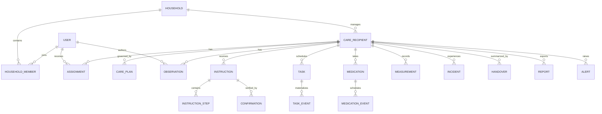
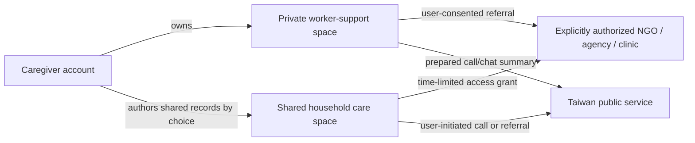
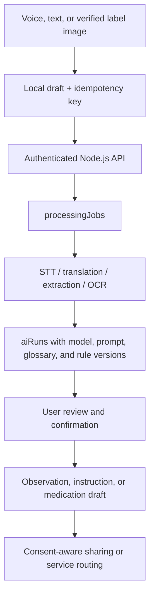

# Entity and Process Diagrams

## Core shared-care domain

```mermaid
erDiagram
  USER ||--o{ HOUSEHOLD_MEMBER : joins
  HOUSEHOLD ||--o{ HOUSEHOLD_MEMBER : contains
  HOUSEHOLD ||--o{ CARE_RECIPIENT : manages
  CARE_RECIPIENT ||--o{ ASSIGNMENT : has
  USER ||--o{ ASSIGNMENT : receives
  CARE_RECIPIENT ||--o{ CARE_PLAN : governed_by
  CARE_RECIPIENT ||--o{ OBSERVATION : has
  USER ||--o{ OBSERVATION : authors
  CARE_RECIPIENT ||--o{ INSTRUCTION : receives
  INSTRUCTION ||--o{ INSTRUCTION_STEP : contains
  INSTRUCTION ||--o{ CONFIRMATION : verified_by
  CARE_RECIPIENT ||--o{ TASK : schedules
  TASK ||--o{ TASK_EVENT : materializes
  CARE_RECIPIENT ||--o{ MEDICATION : takes
  MEDICATION ||--o{ MEDICATION_EVENT : schedules
  CARE_RECIPIENT ||--o{ MEASUREMENT : records
  CARE_RECIPIENT ||--o{ INCIDENT : experiences
  CARE_RECIPIENT ||--o{ HANDOVER : summarized_by
  CARE_RECIPIENT ||--o{ REPORT : exports
  CARE_RECIPIENT ||--o{ ALERT : raises
```

## Privacy boundaries

```mermaid
flowchart LR
  Caregiver[Caregiver account]
  Private[Private worker-support space]
  Household[Shared household care space]
  Partner[Explicitly authorized NGO / agency / clinic]
  Government[Taiwan public service]

  Caregiver -->|owns| Private
  Caregiver -->|authors shared records by choice| Household
  Household -->|time-limited access grant| Partner
  Private -->|user-consented referral| Partner
  Private -->|prepared call/chat summary| Government
  Household -->|user-initiated call or referral| Government
```

## AI processing pipeline

```mermaid
flowchart TD
  Input[Voice, text, or verified label image]
  Local[Local draft + idempotency key]
  API[Authenticated Node.js API]
  Job[processingJobs]
  AI[STT / translation / extraction / OCR]
  Trace[aiRuns with model, prompt, glossary, and rule versions]
  Review[User review and confirmation]
  Domain[Observation, instruction, or medication draft]
  Share[Consent-aware sharing or service routing]

  Input --> Local --> API --> Job --> AI --> Trace --> Review --> Domain --> Share
```
